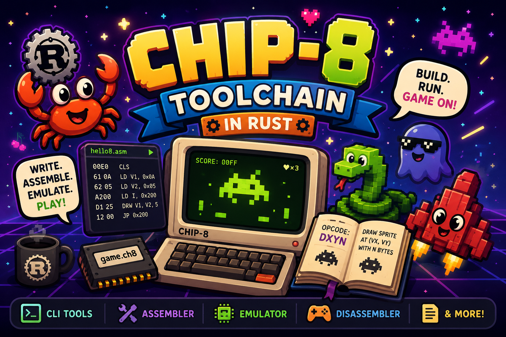

# CHIP-8 Toolchain in Rust

This project started as a simple experiment: write a CHIP-8 emulator in Rust to explore emulator development. I picked CHIP-8 because it has a library of fun games.

While building the emulator, I gained appreciation for the CHIP-8 architecture. It's remarkably simple, yet people managed to create surprisingly sophisticated software with it. That inspired me to go beyond the emulator itself and build the tools needed to create CHIP-8 software from scratch.

The goal of this repository is to become a small but complete CHIP-8 toolchain for writing, assembling, de-assembling and running CHIP-8 programs.

**_BE CURIOUS. HAVE FUN._**



## Toolchain

| Name      | Status         |
| --------- | -------------- |
| Emulator  | ✅ Complete    |
| Assembler | 🚧 In Progress |

## Usage

This repository is organized as a Cargo workspace. To run a tool:

```console
cargo run -p assembler

cargo run -p emulator
```

To run a CHIP-8 ROM with the emulator:

```console
cargo run -p emulator -- ./path/to/rom
```
